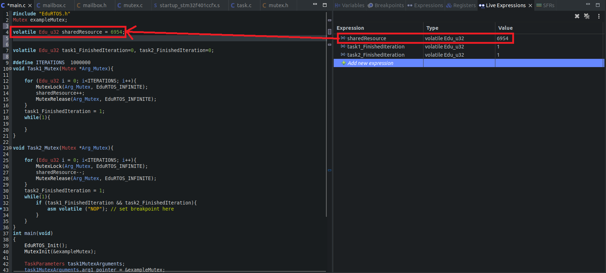

# Mutex
 Mutex is a synchronization primitive used to protect shared resources or critical sections of code in multi-tasking applications, ensuring that only one task can access the protected resource at a time.


## Table of Contents
- [API Reference](#api-reference)
- [Examples](#examples)

## API Reference

- **EduRTOS_StdType_Status MutexInit (Mutex * const Arg_Mutex_pMutex)**

	**Explanation** 

	Initialize Mutex
	
	**Parameters**
	
	Arg_Mutex_pMutex   : Pointer of mutex


	**Return value** 

	Status if it's initialized successfully or not.

- **EduRTOS_StdType_Status MutexLock (Mutex *Arg_Mutex_pMutex, const Edu_u32 Arg_TicksToWait)**

	**Explanation** 

	Lock mutex
	
	**Parameters**
	
	Arg_Mutex_pMutex   : Pointer of Mutex
	Arg_TicksToWait	   : Timeout value for locking mutex


	**Return value** 

	Status if mutex successfully locked or not.

- **EduRTOS_StdType_Status MutexRelease(Mutex *const Arg_Mutex_pMutex, const Edu_u32 Arg_TicksToWait)**

	**Explanation** 

	Release mutex
	
	**Parameters**
	
	Arg_Mutex_pMutex   : Pointer of mutex
	Arg_TicksToWait	   : Timeout value for releasing mutex

	**Return value** 

	Status if mutex successfully released or not.

- **EduMutex_State GetMutexStatus(Mutex * const Arg_Mutex_pMutex)**

	**Explanation** 

	Get status mutex whether it's locked or not
	
	**Parameters**
	
	Arg_Mutex_pMutex   : Pointer of mutex

	**Return value** 

	Status if mutex is locked or not.


## Examples
In this RTOS example for testing Mutexes, a shared resource is initially set to a value of 6954. One task increments this value by one over one million iterations, while another task decrements it by one over one million iterations. The use of Mutexes ensures that this shared resource is protected from concurrent access. If Mutex protection is successful, the final result will match the initially set value.

Additionally, two flags are used to track the completion of the increment and decrement loops. These flags are raised after each iteration is completed. When both flags are raised, a breakpoint is triggered to signal that both tasks have finished their operations, and the shared resource's value is checked.

As illustrated in the provided code example screenshot, the value of "sharedResource" remains the same as the initially set value, confirming the successful protection of the shared resource using Mutexes.


```c
#include "EduRTOS.h"
Mutex exampleMutex;
volatile Edu_u32 sharedResource = 6954;
volatile Edu_u32 task1_FinishedIteration=0, task2_FinishedIteration=0;
#define ITERATIONS	1000000
void Task1_Mutex(Mutex *Arg_Mutex){

	for (Edu_u32 i = 0; i<ITERATIONS; i++){
		MutexLock(Arg_Mutex, EduRTOS_INFINITE);
		sharedResource++;
		MutexRelease(Arg_Mutex, EduRTOS_INFINITE);
	}
	task1_FinishedIteration = 1;
	while(1){

	}
}

void Task2_Mutex(Mutex *Arg_Mutex){

	for (Edu_u32 i = 0; i<ITERATIONS; i++){
		MutexLock(Arg_Mutex, EduRTOS_INFINITE);
		sharedResource--;
		MutexRelease(Arg_Mutex, EduRTOS_INFINITE);
	}
	task2_FinishedIteration = 1;
	while(1){
		if (task1_FinishedIteration && task2_FinishedIteration){
			asm volatile ("NOP"); // Add breakpoint here
		}
	}
}
int main(void)
{
	EduRTOS_Init();
	MutexInit(&exampleMutex);

	TaskParameters task1MutexArguments;
	task1MutexArguments.arg1_pointer = &exampleMutex;
	EduRTOS_CreateTask(Task1_Mutex, 1, 2*1024, &task1MutexArguments);

	TaskParameters task2MutexArguments;
	task2MutexArguments.arg1_pointer = &exampleMutex;
	EduRTOS_CreateTask(Task2_Mutex, 2, 2*1024, &task2MutexArguments);
	RTOS_Start_Scheduler();
	while(1){

	}
}

```


