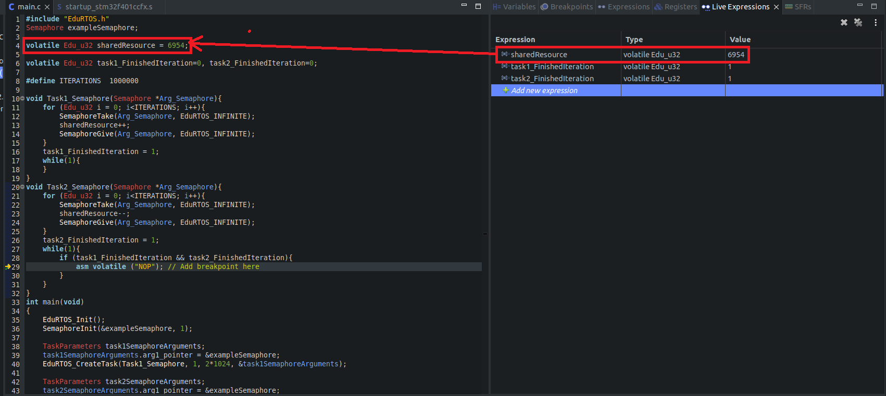

# Semaphore
 Semaphore is a synchronization primitive used to protect shared resources or critical sections of code in multi-tasking applications, ensuring that only one task can access the protected resource at a time.


## Table of Contents
- [API Reference](#api-reference)
- [Examples](#examples)

## API Reference

- **EduRTOS_StdType_Status SemaphoreInit (Semaphore * const Arg_Semaphore_pSemaphore, const uint32_t Arg_Semaphore_InitVal)**

	**Explanation** 

	Initialize Semaphore
	
	**Parameters**
	
	Arg_Semaphore_pSemaphore   : Pointer of Semaphore

	Arg_Semaphore_InitVal	   : Initial value of semaphore

	**Return value** 

	Status if it's initialized successfully or not.

- **EduRTOS_StdType_Status SemaphoreTake (Semaphore * const Arg_Semaphore_pSemaphore, const Edu_u32 Arg_TicksToWait)**

	**Explanation** 

	Take Semaphore
	
	**Parameters**
	
	Arg_Semaphore_pSemaphore   : Pointer of Semaphore

	Arg_TicksToWait			   : Timeout value for taking semaphore

	**Return value** 

	Status if it's taken successfully or not.

- **EduRTOS_StdType_Status SemaphoreGive(Semaphore * const Arg_Semaphore_pSemaphore, const Edu_u32 Arg_TicksToWait)**

	**Explanation** 

	Give Semaphore
	
	**Parameters**
	
	Arg_Semaphore_pSemaphore   : Pointer of Semaphore

	Arg_TicksToWait			   : Timeout value for giving semaphore

	**Return value** 

	Status if it's given successfully or not.
	
## Examples
In this RTOS example for testing Semaphores, a shared resource is initially set to a value of 6954. One task increments this value by one over one million iterations, while another task decrements it by one over one million iterations. The use of Semaphores ensures that this shared resource is protected from concurrent access. If Semaphore protection is successful, the final result will match the initially set value.

Additionally, two flags are used to track the completion of the increment and decrement loops. These flags are raised after each iteration is completed. When both flags are raised, a breakpoint is triggered to signal that both tasks have finished their operations, and the shared resource's value is checked.

As illustrated in the provided code example screenshot, the value of "sharedResource" remains the same as the initially set value, confirming the successful protection of the shared resource using Semaphores.


```c
#include "EduRTOS.h"
Semaphore exampleSemaphore;

volatile Edu_u32 sharedResource = 6954;

volatile Edu_u32 task1_FinishedIteration=0, task2_FinishedIteration=0;

#define ITERATIONS	1000000

void Task1_Semaphore(Semaphore *Arg_Semaphore){
	for (Edu_u32 i = 0; i<ITERATIONS; i++){
		SemaphoreTake(Arg_Semaphore, EduRTOS_INFINITE);
		sharedResource++;
		SemaphoreGive(Arg_Semaphore, EduRTOS_INFINITE);
	}
	task1_FinishedIteration = 1;
	while(1){
	}
}
void Task2_Semaphore(Semaphore *Arg_Semaphore){
	for (Edu_u32 i = 0; i<ITERATIONS; i++){
		SemaphoreTake(Arg_Semaphore, EduRTOS_INFINITE);
		sharedResource--;
		SemaphoreGive(Arg_Semaphore, EduRTOS_INFINITE);
	}
	task2_FinishedIteration = 1;
	while(1){
		if (task1_FinishedIteration && task2_FinishedIteration){
			asm volatile ("NOP"); // Add breakpoint here
		}
	}
}
int main(void)
{
	EduRTOS_Init();
	SemaphoreInit(&exampleSemaphore, 1);

	TaskParameters task1SemaphoreArguments;
	task1SemaphoreArguments.arg1_pointer = &exampleSemaphore;
	EduRTOS_CreateTask(Task1_Semaphore, 1, 2*1024, &task1SemaphoreArguments);

	TaskParameters task2SemaphoreArguments;
	task2SemaphoreArguments.arg1_pointer = &exampleSemaphore;
	EduRTOS_CreateTask(Task2_Semaphore, 2, 2*1024, &task2SemaphoreArguments);
	RTOS_Start_Scheduler();
	while(1){

	}
}

```
